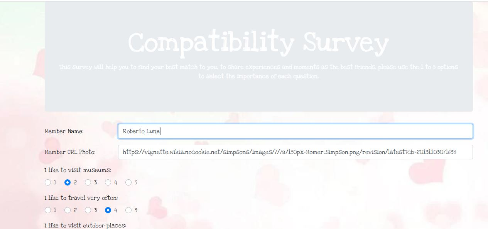
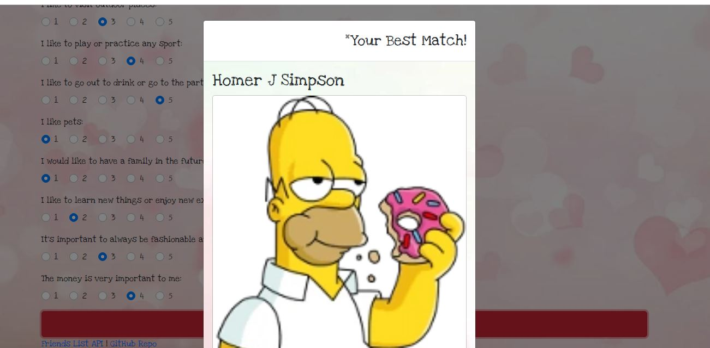

# Friend Finder

## Overview

* The app includes an array with the initial friends that can be matched with the answers of each person
* There is a survey with 10 questions after entering the name and image profile
* After answering the survey the app will look for the best option to be compatible taking the answers and comparing the most common interests
* A modal window will be displayed with the namee and image of the best option
* The app will save your data to be available for next users applying to the survey
* There is a video available (FriendFinder.mp4) to check how the app is working

## Technologies used to develop the app
- HTML5
- CSS3
- Bootstrap
- Javascript
- JQuery
- JSON
- Node.js
- Express.js
- Heroku

## App Link
https://jfsilvah-friendfinder.herokuapp.com/

## Author
ISC Francisco Silva
